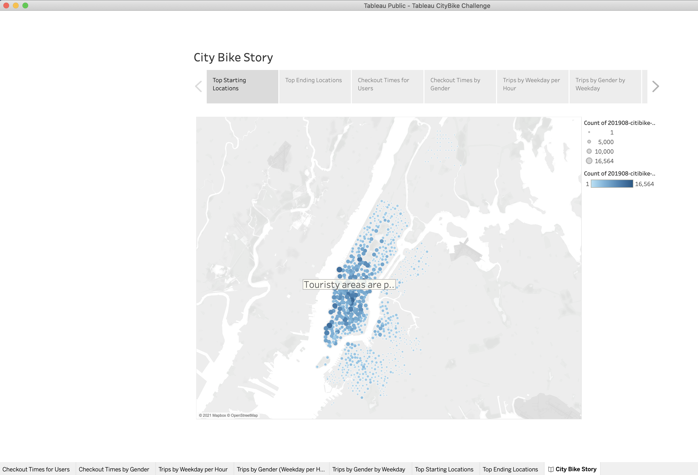
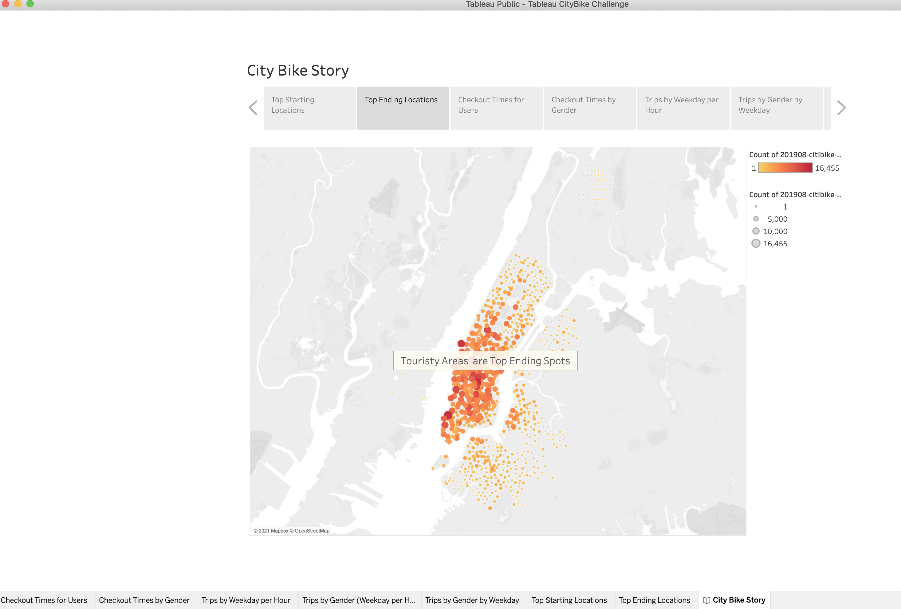
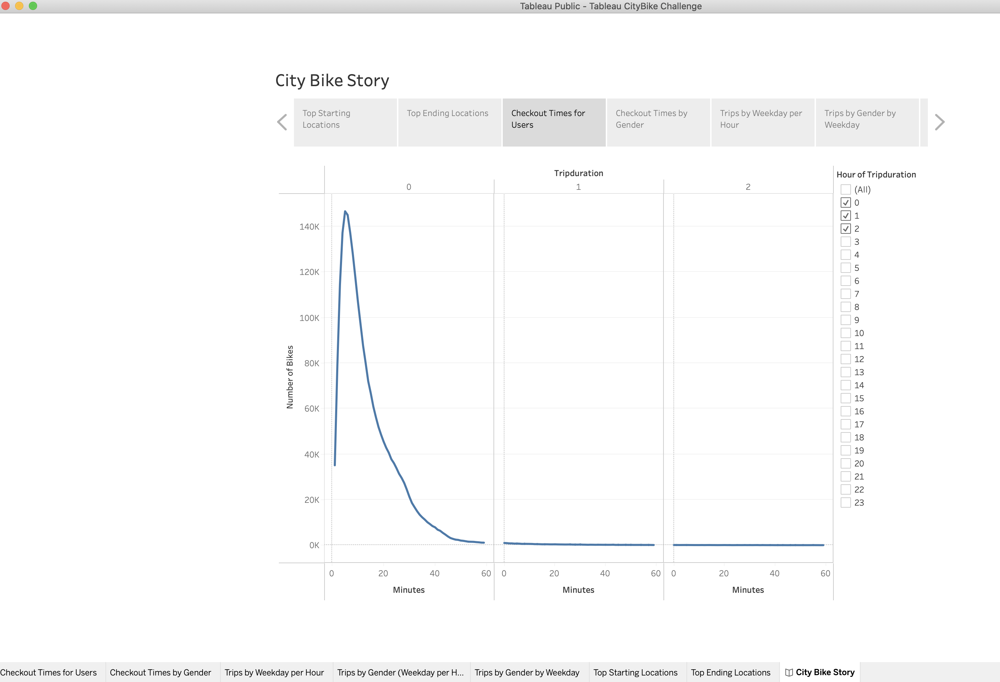
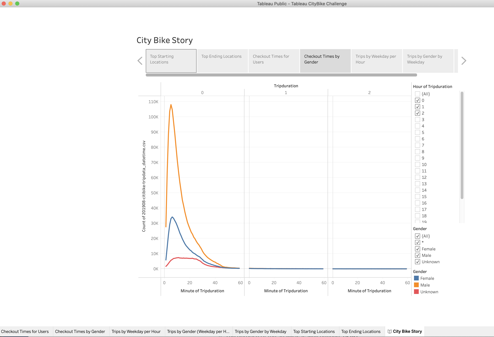
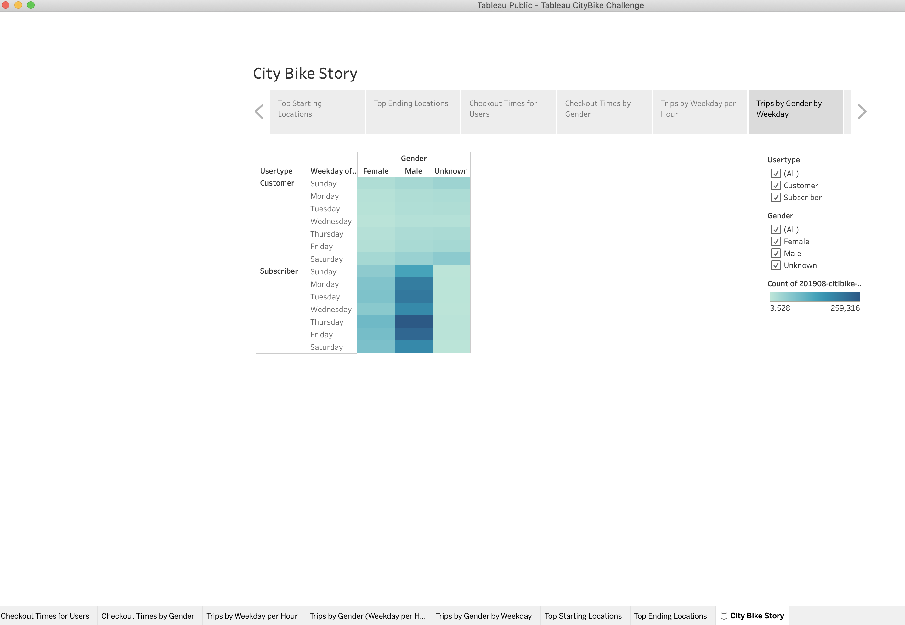
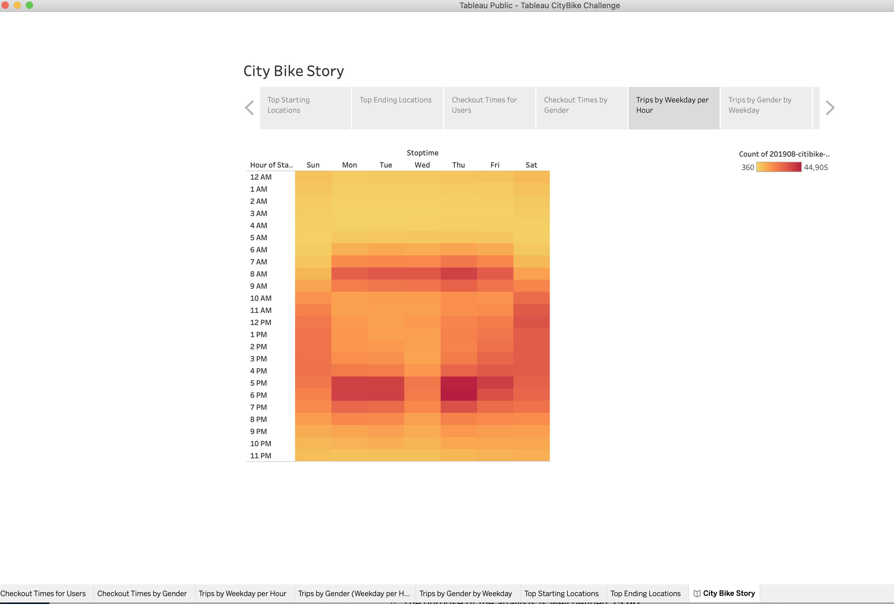
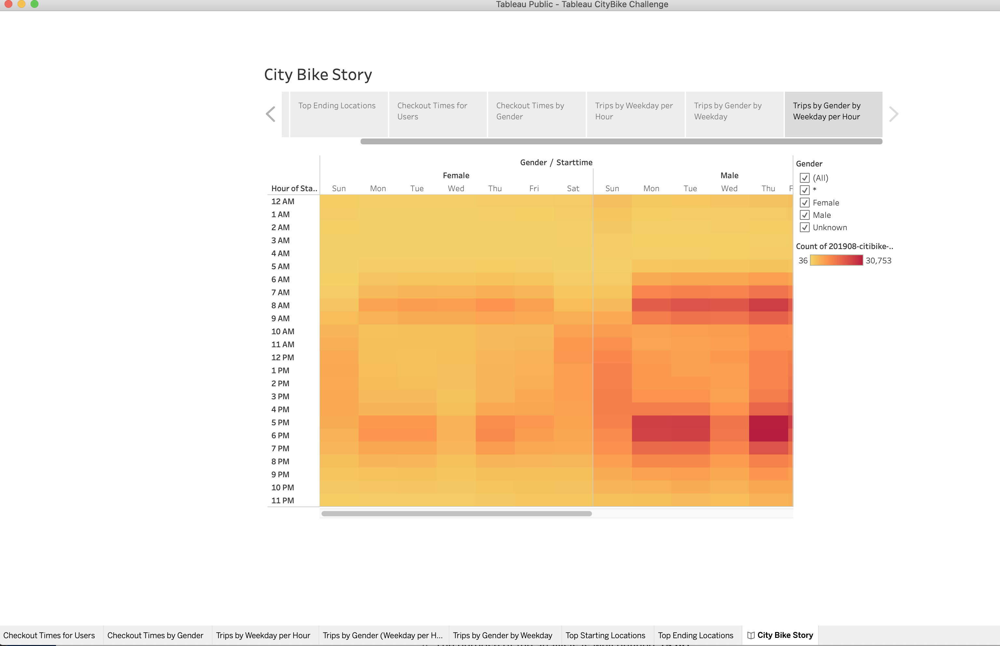

# Link to Tableau Story
[link to Tableau Story](https://public.tableau.com/app/profile/jason.jason/viz/TableauCityBikeChallenge/CityBikeStory)

# Overview
- The purpose of this analysis was to use city bike data from NYC (manhattan) to determine if it makes sense to have a city bike program in Des Moines. 

- Specifically, we wanted to:
	- Show the length of time that bikes are checked out for all riders and genders
	- Show the number of bike trips for all riders and genders for each hour of each day of the week
	- Show the number of bike trips for each type of user and gender for each day of the week.

#Results: Using the visualizations you have in your Tableau Story, describe the results of each visualization underneath the image.

- Story p. 1. This picture shows the top bike starting locations. Most of the popular spots are in the touristy or business areas of Manhattan.

- Story p. 2. This picture shows the top bike ending locations. Most of the popular spots are in the touristy or business areas of Manhattan.

- Story p. 3. This picture plots the trip durations by number of bikes. As the figure shows, the vast majority of bikes are checked out for short periods (~10 minutes).

- Story p. 4. This picture plots the trip durations by number of bikes for each gender. As the figure shows, the vast majority of bikes are checked out for short periods (~10 minutes) for all genders, and more males checkout bikes than females or unknown.

- Story p. 5. This figure plots the number of bikes checked out for each day of the week for each gender for customers and subscribers. The figure shows that most users are subscribers, most bikes are checked out thursday (with friday the 2nd most popular day), and most users are males. The ratio of customers to subscribers and the fact that bikes are most popular on Thursday is true for both males and females.

- Story p. 6. This figure plots the most popular stop times for each time of the week. For weekdays the most popular stop times are before and after work (8-9 am and 5-6 pm). For weekends they are more balanced across the day, with slighlty more stop times around lunchtime (11am -12 pm).

- Story p. 7. his figure plots the most popular stop times for each time of the week seperated by gender. For weekdays, for both males and females the most popular stop times are before and after work (8-9 am and 5-6 pm). For weekends they are more balanced across the day for both males and females, with slighlty more stop times around lunchtime (11am -12 pm).

# Summary: Provide a high-level summary of the results and two additional visualizations that you would perform with the given dataset.

- Summarizing it looks like the touristy/business areas of Manhattan are the best spots to pick up and drop off bikes, most people rent them for only short periods of time and are subscribers, and most people use  them to get to and from work. This suggests the bike program would work in Des Moines in places that are the most popular work spots, and that it would be best to have a subscriber program. 

- Two additional visualizations I would consider are bike rentals by birth year and time (to see what the most popular age range is for renting bikes vs. for what times) and bike rentals by birth year and gender (to see what the most popular bike rentals by birth year are for each gender). 
